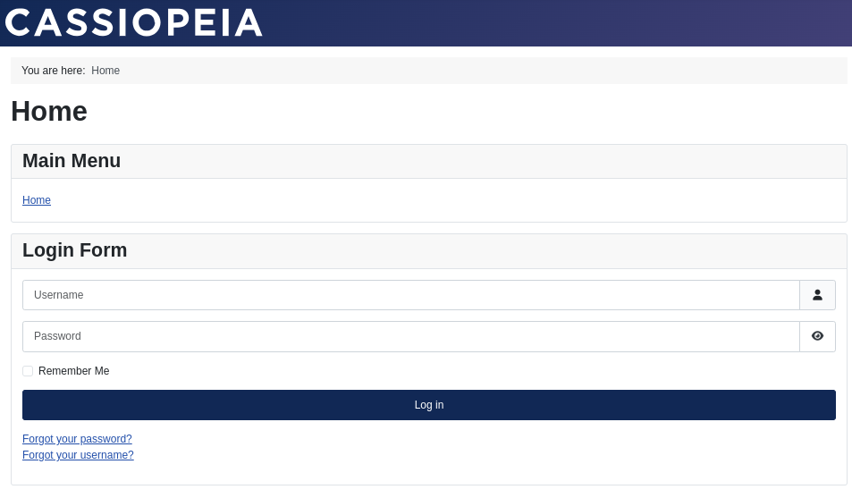

# Ejercicio 7 - 

---

👤 **Autor:** Ana Valladares González

---

## Índice
1. [Configuración inicial](#1--configuración-inicial)
2. [Añadir PHPMyAdmin al docker compose](#1--añadir-phpmyadmin-al-docker-compose)
---

### 1. 🔧 Configuración inicial

#### 📦 Paso 1: Crear el directorio de trabajo para guardar el archivo .yml

Creamos un directorio llamado `ejercicio7` y nos movemos a él.

**Comandos:**
```bash
mkdir ejercicio7
cd ejercicio7
```

#### 📄 Paso 2: Crear el archivo docker-compose.yml y añadir la configuración

Creamos un archivo llamado `docker-compose.yml` y añadimos la configuración necesaria.

**Comandos:**
```bash
nano docker-compose.yml
```

**Contenido:**
```yml
version: '3.8'

services:
  mysql:
    image: mysql:5.7
    container_name: mysql
    environment:
      MYSQL_ROOT_PASSWORD: rootpassword
      MYSQL_DATABASE: joomla
      MYSQL_USER: joomla_user
      MYSQL_PASSWORD: joomlapassword
    volumes:
      - mysql_data:/var/lib/mysql
    networks:
      - joomla-network

  joomla:
    image: joomla
    container_name: joomla
    ports:
      - "8080:80"
    environment:
      JOOMLA_DB_HOST: mysql
      JOOMLA_DB_USER: joomla_user
      JOOMLA_DB_PASSWORD: joomlapassword
      JOOMLA_DB_NAME: joomla
    volumes:
      - joomla_data:/var/www/html
    networks:
      - joomla-network

volumes:
  mysql_data:
  joomla_data:

networks:
  joomla-network:
```

Explicación:
- Creamos dos servicios, `mysql` y `joomla`.
  - En el servicio `mysql`:
    - Usamos la imagen `mysql:5.7`.
    - Definimos las variables de entorno para la contraseña de root, la base de datos, el usuario y la contraseña.
    - Mapeamos el volumen `mysql_data` al directorio `/var/lib/mysql`.
    - Conectamos el servicio al `joomla-network`.
  - En el servicio `joomla`:
    - Usamos la imagen `joomla`.
    - Mapeamos el puerto 8080 del host al puerto 80 del contenedor.
    - Definimos las variables de entorno para la dirección del host de la base de datos, el usuario, la contraseña y el nombre de la base de datos.
    - Mapeamos el volumen `joomla_data` al directorio `/var/www/html`.
    - Conectamos el servicio al `joomla-network`.


### 2. 🐳 Iniciar los servicios del Docker Compose

#### 🚀 Paso 1: Iniciar Docker Compose para iniciar los contenedores en segundo plano

Este comando descargará las imágenes necesarias y levantará los contenedores de Joomla y MySQL en segundo plano.

**Comandos:**
```bash
docker-compose up -d
```


#### 📦 Paso 2: Comprobar que los contenedores están en ejecución

**Comandos:**
```bash
docker ps
```

### 3. 🌐 Verificar el funcionamiento de los servicios

#### 🔒 Paso 1: Acceder a Joomla

En caso de tener la red de la máquina virtual con NAT, abrimos un navegador web y accedemos a la dirección `http://localhost:8080`. En caso de tener la red de la máquina virtual con Adaptador Puente, accedemos a la dirección `http://IP:8080`, en mi caso: 10.0.9.106:8080. Como no hemos puesto ningún archivo en el volumen de Joomla, nos aparecerá la página de instalación de Joomla.


Procedemos a cambiar la configuración del yalm para que se instale automáticamente.

**Comandos:**
```bash
nano docker-compose.yml
```

**Contenido:**
```yml
services:

  joomla:
    image: joomla
    restart: always
    ports:
      - 8080:80
    environment:
      JOOMLA_DB_HOST: db
      JOOMLA_DB_USER: joomla
      JOOMLA_DB_PASSWORD: examplepass
      JOOMLA_DB_NAME: joomla_db
      JOOMLA_SITE_NAME: Joomla
      JOOMLA_ADMIN_USER: Joomla Hero
      JOOMLA_ADMIN_USERNAME: joomla
      JOOMLA_ADMIN_PASSWORD: joomla@secured
      JOOMLA_ADMIN_EMAIL: joomla@example.com
    volumes:
      - joomla_data:/var/www/html
    networks:
      - joomla_network

  db:
    image: mysql:8.0
    restart: always
    environment:
      MYSQL_DATABASE: joomla_db
      MYSQL_USER: joomla
      MYSQL_PASSWORD: examplepass
      MYSQL_RANDOM_ROOT_PASSWORD: '1'
    volumes:
      - db_data:/var/lib/mysql
    networks:
      - joomla_network

volumes:
  joomla_data:
  db_data:

networks:
  joomla_network:
```

Volvemos a ejecutar el comando `docker-compose up -d` para que se apliquen los cambios, y posteriormente accedemos a la dirección `http://localhost:8080` o `http://IP:8080`, con lo que ya nos aparecerá la página de inicio de sesión de Joomla.



Iniciamos sesión con las credenciales que hemos definido en el archivo `docker-compose.yml`.


Si queremos acceder al backend de Joomla, añadimos `/administrator` a la URL. Así, nos aparecerá la página de inicio de sesión del administrador.


Una vez iniciada la sesión, accedemos al panel de administración de Joomla.


---

### 1. 📄 Añadir PHPMyAdmin al docker compose

#### ✏️ Paso 1: Añadir el servicio de PHPMyAdmin al archivo docker-compose.yml

Debemos volver a editar el archivo `docker-compose.yml` para añadir el servicio de PHPMyAdmin.

**Comandos:**
```bash
nano docker-compose.yml
```

**Contenido:**
```yml
  phpmyadmin:
    image: phpmyadmin/phpmyadmin
    restart: always
    ports:
      - 8081:80  # Exponemos phpMyAdmin en el puerto 8081
    environment:
      PMA_HOST: db  # Nombre del servicio de base de datos en Docker Compose
      PMA_USER: joomla
      PMA_PASSWORD: examplepass
    depends_on:
      - db
    networks:
      - joomla_network
```

Quedando finalmene así:


#### 🔄 Paso 2: Volver a ejecutar Docker Compose

Para que se apliquen los cambios, volvemos a ejecutar el comando `docker-compose up -d`. Una vez hecho esto, accedemos a la dirección `http://localhost:8081` o `http://IP:8081` para acceder a PHPMyAdmin.


Con esto, ya tendremos acceso a PHPMyAdmin para gestionar la base de datos de Joomla.